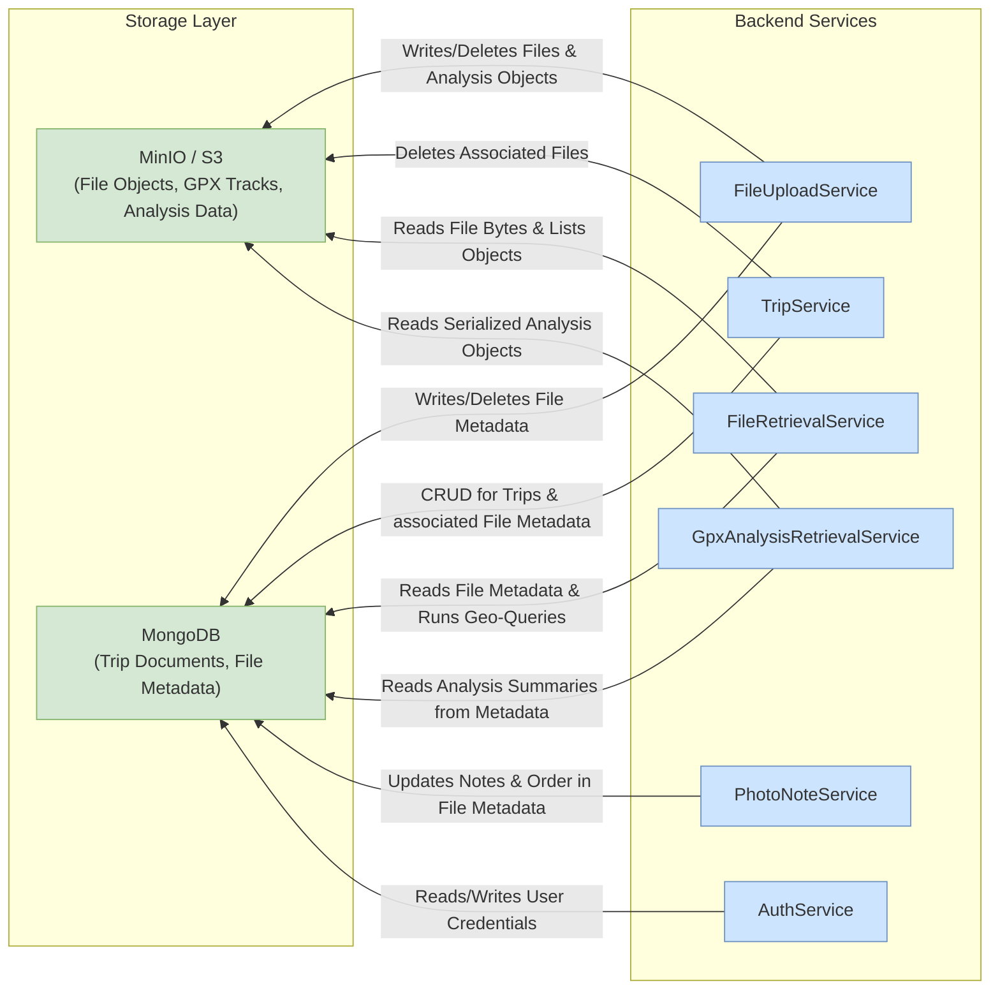

# Backend Data Storage Interaction Guide

This document outlines the architecture and usage patterns for interacting with the data storage layer from the backend server.

## 1. High-Level Architecture

The backend employs a hybrid data storage strategy, utilizing two distinct systems orchestrated by Docker Compose:

-   **MongoDB**: Serves as the primary database for storing structured **metadata**. This includes trip details, user information, and metadata about files (e.g., image filenames, creation dates, locations).
-   **MinIO**: An S3-compatible object storage service used for storing unstructured **file data**. This includes user-uploaded assets like images, GPX tracks, and other binary files.

## 2. Core Design: The Adapter Pattern

To ensure a clean separation of concerns and maintain flexibility, the backend uses a **Storage Adapter Pattern**. This pattern decouples the business logic (services) from the underlying storage implementation.

The key components of this design are:

-   **`StorageAdapter`** (`/server/src/utils/dbbutler/storage_adapter.py`): An abstract base class that defines a common interface for all storage interactions. It mandates methods like `save_data`, `load_data`, `delete_data`, `exists`, etc.

-   **Concrete Adapters**:
    -   **`MongoDBAdapter`** (`/server/src/utils/dbbutler/mongodb_adapter.py`): The implementation of `StorageAdapter` for MongoDB. It handles all CRUD operations for documents in the MongoDB database.
    -   **`MinIOAdapter`** (`/server/src/utils/dbbutler/minio_adapter.py`): The implementation of `StorageAdapter` for MinIO. It manages all file and object operations, such as uploads, downloads, and deletions.

-   **`AdapterFactory`** (`/server/src/utils/adapter_factory.py`): A factory class responsible for creating and configuring adapter instances. It reads connection details from environment variables, centralizing configuration and hiding implementation details from the services that consume the adapters.

This architecture allows a service to request an adapter from the factory and use it without needing to know the specific connection details or the library used to communicate with the database.

## 3. How to Interact with Storage

### 3.1. Using the AdapterFactory

The `AdapterFactory` is the designated entry point for accessing any storage system. It provides static methods to get pre-configured adapter instances.

-   `AdapterFactory.create_mongodb_adapter()`: Returns an instance of `MongoDBAdapter`.
-   `AdapterFactory.create_minio_adapter()`: Returns an instance of `MinIOAdapter`.

### 3.2. MongoDB Interaction

**Purpose**: Storing and retrieving structured JSON-like documents.

**Configuration**: The `MongoDBAdapter` is configured via the following environment variables:
-   `MONGODB_HOST` (default: `localhost`)
-   `MONGODB_PORT` (default: `27017`)
-   `MONGODB_DATABASE` (default: `travel_tracker`)

**Usage Example (within a service):**

```python
from src.utils.adapter_factory import AdapterFactory
from src.utils.dbbutler.storage_manager import StorageManager

# Using the Adapter directly (MongoDBAdapter expects key/_id and collection_name)
mongodb_adapter = AdapterFactory.create_mongodb_adapter()
collection = "trips"
trip_id = "trip-123"
trip_data = {"name": "My Awesome Trip", "location": "The Alps"}

# Save document: `key` will be used as the document `_id` (upsert)
mongodb_adapter.save_data(trip_id, trip_data, collection_name=collection)

# Load document by its key/_id
retrieved_trip = mongodb_adapter.load_data(trip_id, collection_name=collection)
print(f"Retrieved Trip: {retrieved_trip}")

# Recommended: using StorageManager (services in this repo use StorageManager)
sm = StorageManager()
sm.add_adapter('mongodb', mongodb_adapter)
sm.save_data(trip_id, trip_data, adapter_name='mongodb', collection_name=collection)
retrieved = sm.load_data('mongodb', trip_id, collection_name=collection)
```

### 3.3. MinIO Interaction

**Purpose**: Storing and retrieving binary files (objects).

**Configuration**: The `MinIOAdapter` is configured via the following environment variables. For local development, these should be placed in a `server/.env` file.
-   `MINIO_ENDPOINT` (default: `localhost:9000`)
-   `MINIO_ACCESS_KEY` (Required)
-   `MINIO_SECRET_KEY` (Required)
-   `MINIO_SECURE` (default: `False`)

> **Note on Local Development**: When running the development environment using `docker-compose.dbonly.yml` and starting the backend on the host, the default credentials are `minioadmin` for both `MINIO_ACCESS_KEY` and `MINIO_SECRET_KEY`. Your `server/.env` file should reflect this.

**Common Buckets Used**

- `images`: photo/object uploads (stored by `ImageHandler`).
- `gps-data`: raw GPX track files (stored by `GPXHandler`).
- `gps-analysis-data`: serialized GPX analysis artifacts (pickled analyzed track objects).
- `gis-data`: miscellaneous GIS assets (e.g., precomputed pickles used by map services).
- `uploadedfiles`: generic uploaded files such as CSVs handled by `CSVHandler`.

These are the bucket names used by the handlers and services in the `server/` codebase; you may change them in deployment but update the code or environment accordingly.

**Uploader lineage & permissions**
- Each file metadata document tracks `uploader_id` (set by the server from the authenticated user).
- File listing responses compute `can_delete` per requester (true for trip owner or original uploader) so the frontend can hide controls without trusting client logic.
- If upgrading an existing database, run `python server/scripts/migrate_uploader_ownership.py` once to backfill `uploader_id` on older documents before relying on `can_delete`.

**Usage Example (within a service):**

```python
from src.utils.adapter_factory import AdapterFactory
from src.utils.dbbutler.storage_manager import StorageManager

# Get a pre-configured MinIO adapter
minio_adapter = AdapterFactory.create_minio_adapter()

# File data to be uploaded
bucket_name = "images"  # repo commonly uses `images`, `gps-data`, `gps-analysis-data`
object_name = "trip-123/photo.jpg"
image_bytes = b"..."  # Your image data as bytes

# Save a file using the adapter API
minio_adapter.save_data(object_name, image_bytes, bucket=bucket_name)
print(f"File '{object_name}' uploaded to bucket '{bucket_name}'.")

# Check if the file exists
if minio_adapter.exists(object_name, bucket=bucket_name):
    print("File exists!")

# Load the file
data = minio_adapter.load_data(object_name, bucket=bucket_name)
print(f"Loaded {len(data)} bytes.")

# Or using StorageManager (recommended in service code):
sm = StorageManager()
sm.add_adapter('minio', minio_adapter)
sm.save_data(object_name, image_bytes, adapter_name='minio', bucket=bucket_name)
```

## 4. Architecture Diagram

Here is a diagram illustrating the flow from a backend service to the storage layer, updated to reflect the specific interactions detailed in Section 5.



## 5. Service-Level Storage Interaction

This section details which services interact with the storage layer and for what purpose.

### `auth_routes.py` & `auth.py` & `user_routes.py`

-   **Module:** `auth` / `auth_routes` / `user_routes`
-   **Purpose:** Manages user authentication, registration, token validation, and user profiles.
-   **Functions & Storage Interaction:**
    -   `register_user()`:
        -   **MongoDB:** Checks if a username exists in the `users` collection. If not, inserts a new user document with hashed password and profile details.
    -   `login_for_access_token()`:
        -   **MongoDB:** Retrieves a user document from the `users` collection by username to verify the password hash.
    -   `get_current_user()`:
        -   **MongoDB:** Retrieves a user document from the `users` collection to validate the subject (`sub`) claim of the JWT token.
    -   `read_users_me()` / `get_user_profile()`:
        -   **MongoDB:** Retrieves user profile data and fetches pinned trips from the `trips` collection.
    -   `update_user_me()`:
        -   **MongoDB:** Updates user fields (bio, location, pinned_trips) in the `users` collection.
    -   `upload_avatar()`:
        -   **MinIO:** Saves the avatar image to the `images` bucket via `FileUploadService`.
        -   **MongoDB:** Updates the user's `avatar_url` field.
    -   `search_users()`:
        -   **MongoDB:** Performs a regex search on `username` or `full_name` in the `users` collection.

### `file_upload_service.py`

-   **Class:** `FileUploadService`
-   **Purpose:** Handles the entire file upload process, including processing, metadata extraction, and storage.
-   **Functions & Storage Interaction:**
    -   `save_file()`:
        -   **MinIO:** The appropriate `data_io_handler` (e.g., `ImageHandler`) saves the file content to a MinIO bucket (the repo uses `images` for photos and `gps-data` for raw GPX). For GPX files, it also saves a serialized analysis object to the `gps-analysis-data` bucket.
        -   **MongoDB:** Saves a comprehensive `FileMetadata` document to the `file_metadata` collection, containing details about the file, EXIF data, GPS coordinates, analysis summaries, and the `uploader_id` of the user who performed the upload (enforced server-side; client values are ignored).
        -   **GPX Handling:** Manages the 1:1 relationship between a trip and a GPX file. When a new GPX file is uploaded for a trip, it replaces any existing GPX file and its associated metadata.
        -   **Event Hooks:** When GPX analysis completes the service updates the trip's denormalized stats via `TripService.update_trip_stats(...)` and publishes a `GPX_PROCESSED` event on the internal `EventBus`. This keeps the `UserStatsService`/`AchievementEngine` pipeline informed about new distance and elevation data.
        -   **Authorization:** Uploads require the requester to be the trip owner or a listed member; otherwise the route returns 403.
    -   `get_file_metadata()`:
        -   **MongoDB:** Loads a specific `FileMetadata` document from the `file_metadata` collection.
    -   `delete_file()`:
        -   **MinIO:** Deletes the file object from its bucket.
        -   **MongoDB:** Deletes the corresponding `FileMetadata` document from the `file_metadata` collection.
        -   **Permissions:** Enforces that only the Trip Owner or the original Uploader can delete a file.

### `trip_service.py`

-   **Class:** `TripService`
-   **Purpose:** Manages all CRUD operations for trips.
-   **Functions & Storage Interaction:**
    -   `create_trip()`:
        -   **MongoDB:** Saves a new `Trip` document to the `trips` collection.
    -   `get_trips()`:
        -   **MongoDB:** Loads all `Trip` documents from the `trips` collection.
    -   `get_trip()`:
        -   **MongoDB:** Loads a single `Trip` document from the `trips` collection by its ID.
    -   `update_trip()`:
        -   **MongoDB:** Updates an existing `Trip` document in the `trips` collection.
    -   `update_members()`:
        -   **MongoDB:** Updates the `member_ids` field of a `Trip` document.
    -   `delete_trip()`:
        -   **MongoDB:** Deletes the `Trip` document from the `trips` collection. It also queries and deletes all associated documents from the `file_metadata` collection.
        -   **MinIO:** Deletes all associated file objects (both original files and analysis artifacts) from their respective buckets based on the metadata retrieved before deletion.

### `file_retrieval_service.py`

-   **Class:** `FileRetrievalService`
-   **Purpose:** Retrieves file lists, metadata, and raw file content.
-   **Functions & Storage Interaction:**
    -   `list_files()`:
        -   **MinIO:** Lists object keys from a specified bucket, optionally filtered by a prefix (like a `trip_id`).
    -   `list_files_with_metadata()`:
        -   **MinIO:** Lists all object keys in a bucket.
        -   **MongoDB:** Fetches all corresponding documents from the `file_metadata` collection and merges the information.
        -   **Permissions:** Computes a `can_delete` boolean flag for each file based on the requesting user's identity (true if trip owner or original uploader); the field is returned in responses but never stored.
    -   `list_geotagged_images()`:
        -   **MongoDB:** Performs a geospatial query on the `file_metadata` collection to find images with GPS data, optionally within a specific bounding box.
    -   `get_file_bytes()`:
        -   **MinIO:** Loads the raw byte content of a specific file object from a bucket.

### `gpx_analysis_retrieval_service.py`

-   **Class:** `GpxAnalysisRetrievalService`
-   **Purpose:** Loads and deserializes persisted GPX analysis data.
-   **Functions & Storage Interaction:**
    -   `get_analyzed_track()`:
        -   **MinIO:** Loads a pickled `AnalyzedTrackObject` from the `gps-analysis-data` bucket.
    -   `get_track_summary()`:
        -   **MongoDB:** Loads a `FileMetadata` document from the `file_metadata` collection to retrieve the `track_summary` field without loading the full analysis object.

### `photo_note_service.py`

-   **Class:** `PhotoNoteService`
-   **Purpose:** Manages notes and ordering for photos.
-   **Functions & Storage Interaction:**
    -   `update_note()`:
        -   **MongoDB:** Updates the `note` and `note_title` fields of a specific document in the `file_metadata` collection.
    -   `update_order()`:
        -   **MongoDB:** Updates the `order_index` field of a specific document in the `file_metadata` collection.

### `user_stats_service.py`

-   **Module:** `src/services/user_stats_service.py`
-   **Purpose:** Recalculates and persists derived statistics (`total_distance_km`, `total_elevation_gain_m`, `total_trips`) for every user based on the trips where they appear in `member_ids`.
-   **Functions & Storage Interaction:**
    -   `calculate_stats(user_id)`:
        -   **MongoDB:** Runs an aggregation pipeline on the `trips` collection summing `trip.stats.*` values for any document whose `member_ids` array contains the target user (string or `ObjectId`).
    -   `sync_user_stats(user_id)` / `sync_multiple_users(user_ids)`:
        -   **MongoDB:** Writes the aggregated totals back onto the corresponding `users` document so profile queries can read denormalized stats without recomputation.

### `achievement_engine.py`

-   **Module:** `src/services/achievement_engine.py`
-   **Purpose:** Listens for `EventBus` notifications and awards badges whenever a user's cumulative stats cross predefined thresholds.
-   **Functions & Storage Interaction:**
    -   `handle_gpx_processed(payload)` / `handle_member_added(payload)`:
        -   **MongoDB:** Uses `$inc` updates on the `users` collection to increment totals for every user in the event payload, then calls `_check_and_award_badges` to append earned badge IDs.
    -   `_check_and_award_badges(user_doc, collection)`:
        -   **MongoDB:** Issues `$addToSet` updates to persist newly earned badges without duplicates.

### `events/event_bus.py`

-   Provides an in-process pub/sub utility used by `FileUploadService` and `TripService` to emit lifecycle events (`GPX_PROCESSED`, `MEMBER_ADDED`).
-   Subscriptions are registered in `src/app.py`, wiring the `AchievementEngine` handlers at application startup.
