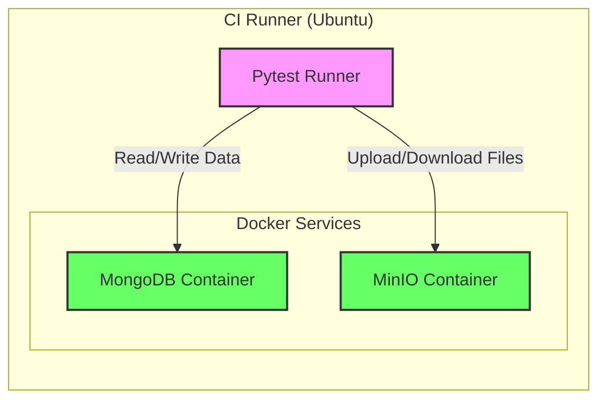

# DevOps & CI/CD Design Document

## 1. Purpose & Motivation

As the **Travel Tracker** application scales, manual testing and deployment become bottlenecks that introduce risk. Implementing a robust **Continuous Integration and Continuous Deployment (CI/CD)** pipeline and a structured **Automated Testing Strategy** is essential to:

*   **Ensure Code Quality**: Automatically catch bugs, syntax errors, and type mismatches before they reach the main branch.
*   **Accelerate Development**: Allow developers to merge with confidence, knowing that regressions will be flagged immediately.
*   **Standardize Processes**: Enforce consistent formatting, linting, and testing practices across the team.
*   **Streamline Deployment**: Automate the build and delivery process to ensure that the production environment always reflects the latest stable code.

## 2. System Overview

The application follows a containerized microservices architecture:

*   **Frontend**: React SPA (Single Page Application) served via Nginx.
*   **Backend**: Python FastAPI server handling business logic.
*   **Storage**:
    *   **MongoDB**: Stores structured metadata (trips, users, file info).
    *   **MinIO**: S3-compatible object storage for binary files (images, GPX tracks).
*   **Infrastructure**: Docker Compose is used for orchestration.

## 3. CI/CD Workflow Design

We utilize **GitHub Actions** for our CI/CD pipeline due to its tight integration with the repository and support for containerized workflows.

### 3.1. Workflow Triggers
*   **Pull Requests (PRs)**: Trigger `Lint` and `Test` jobs to validate changes before merging.
*   **Push to `main` / `dev`**: Trigger `Lint`, `Test`, and `Build` jobs.

### 3.2. Pipeline Architecture

We separate concerns into two primary workflows: **Frontend CI** and **Backend CI**.

#### Pipeline Flowchart

```mermaid
graph TD
    subgraph Triggers
        PR[Pull Request]
        Push[Push to main/dev]
    end

    subgraph "Frontend CI Pipeline"
        F_Setup[Setup Node.js]
        F_Install[Install Dependencies]
        F_Lint[Lint (ESLint)]
        F_Test[Unit Tests (Jest)]
        F_Build[Build (npm run build)]
        
        F_Setup --> F_Install
        F_Install --> F_Lint
        F_Install --> F_Test
        F_Lint --> F_Build
        F_Test --> F_Build
    end

    subgraph "Backend CI Pipeline"
        B_Setup[Setup Python]
        B_Install[Install Dependencies]
        B_Lint[Lint (Flake8)]
        B_Type[Type Check (Mypy)]
        B_Unit[Unit Tests (Pytest)]
        B_Integ[Integration Tests]
        
        B_Setup --> B_Install
        B_Install --> B_Lint
        B_Install --> B_Type
        B_Install --> B_Unit
        B_Unit --> B_Integ
    end

    PR --> F_Setup
    PR --> B_Setup
    Push --> F_Setup
    Push --> B_Setup
```

#### A. Frontend CI Pipeline (`frontend-ci.yml`)
1.  **Setup**: Checkout code, install Node.js, cache `node_modules`.
2.  **Install**: Run `npm ci` for a clean install of dependencies.
3.  **Lint**: Run ESLint to check for code style and potential errors.
4.  **Test**: Run unit tests using Jest (`npm test`).
5.  **Build**: Execute `npm run build` to verify the application compiles correctly.

#### B. Backend CI Pipeline (`backend-ci.yml`)
1.  **Setup**: Checkout code, install Python, cache `pip` packages.
2.  **Install**: Install dependencies from `requirements-dev.txt`.
3.  **Lint & Format**:
    *   Run `flake8` for style guide enforcement.
    *   Run `mypy` for static type checking.
4.  **Unit Tests**: Run `pytest` with mocked dependencies (fast feedback).
5.  **Integration Tests**:
    *   Spin up ephemeral **MongoDB** and **MinIO** service containers.
    *   Run `pytest` with a specific marker (e.g., `@pytest.mark.integration`) to test real database interactions.

## 4. Testing Architecture

### 4.1. Backend Testing Strategy
*   **Unit Tests**:
    *   **Scope**: Individual functions, services, and utility classes.
    *   **Approach**: Use `unittest.mock` or custom fake adapters to isolate logic from the database.
    *   **Location**: `server/tests/`
*   **Integration Tests**:
    *   **Scope**: API endpoints, database queries, and file storage operations.
    *   **Approach**: Use real Docker containers for MongoDB and MinIO. The test runner connects to these local services.
    *   **Location**: `server/tests/integration/`

### 4.2. Frontend Testing Strategy
*   **Unit/Component Tests**:
    *   **Scope**: Individual React components and utility hooks.
    *   **Tool**: Jest + React Testing Library.
    *   **Approach**: Render components in a virtual DOM, fire events, and assert on the output. Mock API calls using `jest.mock` or `msw`.

### Test Environment Diagram



## 5. Implementation Plan

### 5.1. Directory Structure Updates
We need to add the `.github` folder for workflows and slightly reorganize tests for clarity.

```text
travel-tracker/
├── .github/
│   └── workflows/
│       ├── backend-ci.yml      <-- NEW
│       └── frontend-ci.yml     <-- NEW
├── client/
│   └── package.json            <-- Update scripts
├── server/
│   ├── setup.cfg               <-- Update/Verify config
│   └── tests/
│       ├── integration/        <-- NEW (Future use)
│       └── ...
└── ...
```

### 5.2. Configuration Files

#### 1. Frontend Workflow: `.github/workflows/frontend-ci.yml`

```yaml
name: Frontend CI

on:
  push:
    branches: [ main, dev ]
    paths:
      - 'client/**'
  pull_request:
    branches: [ main, dev ]
    paths:
      - 'client/**'

jobs:
  build-and-test:
    runs-on: ubuntu-latest
    defaults:
      run:
        working-directory: ./client

    steps:
      - uses: actions/checkout@v4

      - name: Use Node.js
        uses: actions/setup-node@v4
        with:
          node-version: '18'
          cache: 'npm'
          cache-dependency-path: client/package-lock.json

      - name: Install Dependencies
        run: npm ci

      - name: Lint
        run: npm run lint
        # Note: Ensure "lint": "eslint src/**/*.js" is added to package.json

      - name: Run Tests
        run: npm test -- --watchAll=false --passWithNoTests

      - name: Build
        run: npm run build
```

#### 2. Backend Workflow: `.github/workflows/backend-ci.yml`

```yaml
name: Backend CI

on:
  push:
    branches: [ main, dev ]
    paths:
      - 'server/**'
  pull_request:
    branches: [ main, dev ]
    paths:
      - 'server/**'

jobs:
  test:
    runs-on: ubuntu-latest
    defaults:
      run:
        working-directory: ./server

    services:
      # Ephemeral services for integration testing
      mongo:
        image: mongo:6.0
        ports:
          - 27017:27017
        options: >-
          --health-cmd mongo
          --health-interval 10s
          --health-timeout 5s
          --health-retries 5
      
      minio:
        image: minio/minio
        ports:
          - 9000:9000
        env:
          MINIO_ROOT_USER: minioadmin
          MINIO_ROOT_PASSWORD: minioadmin
        options: >-
          --health-cmd "curl -f http://localhost:9000/minio/health/live"
          --health-interval 10s
          --health-timeout 5s
          --health-retries 5

    steps:
      - uses: actions/checkout@v4

      - name: Set up Python
        uses: actions/setup-python@v5
        with:
          python-version: '3.10'
          cache: 'pip'

      - name: Install Dependencies
        run: |
          python -m pip install --upgrade pip
          pip install -r requirements-dev.txt

      - name: Lint with Flake8
        run: |
          # stop the build if there are Python syntax errors or undefined names
          flake8 . --count --select=E9,F63,F7,F82 --show-source --statistics
          # exit-zero treats all errors as warnings. The GitHub editor is 127 chars wide
          flake8 . --count --exit-zero --max-complexity=10 --max-line-length=127 --statistics

      - name: Type Check with Mypy
        run: mypy src/

      - name: Run Unit Tests
        env:
          # Environment variables for testing
          MONGODB_HOST: localhost
          MONGODB_PORT: 27017
          MINIO_ENDPOINT: localhost:9000
          MINIO_ACCESS_KEY: minioadmin
          MINIO_SECRET_KEY: minioadmin
          MINIO_SECURE: "False"
        run: |
          pytest
```

### 5.3. Required Changes to Existing Files

1.  **`client/package.json`**: Add a lint script.
    ```json
    "scripts": {
      "lint": "eslint src"
    }
    ```

2.  **`server/setup.cfg`**: Ensure `flake8` and `mypy` configurations are present to avoid conflicts with the CI commands.

## 6. Assumptions & Dependencies

*   **GitHub Actions**: The repository is hosted on GitHub.
*   **Docker**: The CI runner supports Docker (standard on GitHub-hosted runners).
*   **Environment Variables**: Secrets (like production API keys) are managed via GitHub Secrets, though for CI/Testing, we use default/dummy values.
*   **Node Version**: 18.x (LTS).
*   **Python Version**: 3.10+.
